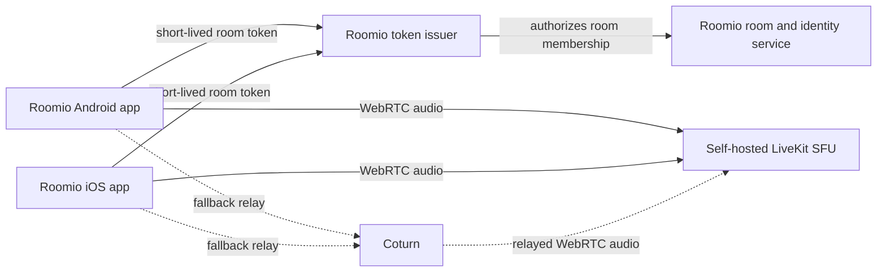

# Voice Chat Technical Design

- **Status:** Planned; no implementation yet
- **Date:** 2026-07-23
- **Decision:** Use self-hosted LiveKit for Roomio's first real voice release.

## 1. Summary

Roomio will add audio-only voice chat to watch-party rooms. The first release supports Android and iOS, uses standard WebRTC transport encryption, and is designed for rooms of up to eight connected participants. The browser prototype remains mock-only and desktop voice is deferred.

LiveKit is the selected media layer because its open-source SFU, Android SDK, and Swift SDK provide a much smaller integration surface than building WebRTC signaling and media routing ourselves. It also avoids the client upload growth and relay-cost uncertainty of a WebRTC mesh. LiveKit is self-hosted on Roomio-controlled infrastructure; no managed LiveKit Cloud account is required.

This design implements the voice-only requirement and active-speaker indicators from REQ-024 and REQ-025. It does not alter Roomio's local playback, Sync, owner, or ownerless-room rules.

## 2. Goals and non-goals

### Goals

- Let a verified room participant join, leave, mute, and unmute an audio-only voice session.
- Show a reliable speaking indicator on the participant's Roomio avatar.
- Support up to eight participants per room with conversational latency and automatic reconnection.
- Keep LiveKit credentials and API secrets outside all client applications.
- Allow Roomio to self-host its media service and control its data residency.

### Non-goals

- Text chat, video publishing, screen sharing, recording, transcription, moderation, or bots.
- End-to-end encryption beyond WebRTC's normal encrypted transport.
- A real-media implementation in the React/Vite prototype.
- Desktop/JVM voice in the first release.
- Replacing Roomio's existing room, invite, ownership, or playback synchronization model.

## 3. Selected architecture



### 3.1 LiveKit and Coturn deployment

- Run one regional LiveKit instance and a hardened Coturn instance on Roomio-controlled infrastructure. Put both behind TLS and allow the required UDP relay port range.
- Start as a single LiveKit node; do not introduce Redis or multi-region routing until usage requires horizontal scale.
- Use Opus audio with LiveKit's normal WebRTC congestion control and reconnection behavior. The SFU forwards audio; it does not transcode, record, or persist it.
- Coturn is the network fallback when a client cannot form a usable UDP path. It is required for reliable mobile and restrictive-network connectivity, not as the normal media path.

### 3.2 Room authorization and token issuance

The mobile app never receives the LiveKit API secret. It calls a trusted Roomio endpoint after the user has authenticated and Roomio has verified that the user is entitled to join the requested party.

`POST /voice/session-token`

Request:

```json
{ "roomId": "MOON-42" }
```

Successful response:

```json
{
  "serverUrl": "wss://voice.roomio.app",
  "token": "<short-lived LiveKit JWT>",
  "expiresAt": "2026-07-23T12:10:00Z"
}
```

The token must contain a stable Roomio participant identity and grants limited to joining that one LiveKit room, publishing microphone audio, and subscribing to other participants' audio. It expires quickly and is refreshed by requesting a new token after reconnect or expiry. Roomio's room ID is the LiveKit room name.

The token issuer is a minimal integration point, not a new general-purpose voice backend. It must use the product's eventual authentication and room-membership source of truth. Until those systems exist, no production token endpoint is implemented.

### 3.3 Client integration

Keep Roomio voice behavior platform-neutral in `sharedUI` and place media SDK calls in platform integrations.

```kotlin
interface VoiceRoomSession {
    val state: StateFlow<VoiceConnectionState>
    val participants: StateFlow<List<VoiceParticipant>>
    val activeSpeakerIds: StateFlow<Set<String>>

    suspend fun join(roomId: String)
    suspend fun leave()
    suspend fun setMicrophoneEnabled(enabled: Boolean)
}
```

- **Android:** Implement the interface with the LiveKit Android/Kotlin SDK. Request `RECORD_AUDIO` at the moment the user enables voice, not at app launch.
- **iOS:** Implement the same interface through a thin iOS adapter around LiveKit's Swift SDK. Request microphone permission at the equivalent user action.
- **Shared UI:** Render `activeSpeakerIds` as the existing avatar speaking indicator. The UI must distinguish muted, connecting, connected, reconnecting, microphone denied, and offline states without relying on color alone.
- **Audio defaults:** A participant joins muted. Enabling their microphone is a deliberate action. The operating system owns speaker, wired-headset, and Bluetooth routing.

Voice room membership does not confer any playback or ownership permission. If Roomio's owner leaves, remaining participants retain their voice connection exactly as they retain local playback; no voice participant becomes the Roomio owner.

## 4. Capacity, latency, quality, and cost

For an audio bitrate of `B`, an eight-person SFU room has approximately `8B` inbound plus `8 x 7 x B` outbound media traffic, or `64B` before protocol overhead. At a nominal 32 kbps Opus stream, that is roughly 2 Mbps of media traffic (about 0.9 GB per fully active room-hour before overhead). Speech activity and adaptive bitrate reduce typical use; capacity must be measured rather than billed from this estimate.

The SFU gives each client one upstream audio track, rather than requiring each participant in a peer mesh to upload seven copies. That makes quality and battery behavior more stable as the room approaches the eight-person target. Place the first server in the region closest to Roomio's primary users, then measure real device-to-device latency. A practical release target is median conversational latency below 300 ms on healthy Wi-Fi or cellular networks, with degraded-network behavior reported rather than hidden.

The operating costs are the always-on LiveKit/Coturn compute instances plus outbound media bandwidth. No recording, transcoding, or storage cost is introduced by this design.

## 5. Security and privacy

- WebRTC encrypts media in transit; this design does not claim end-to-end encryption, because SFU-compatible E2EE is explicitly out of scope for v1.
- Use HTTPS/WSS, authenticated token issuance, short token lifetimes, room-scoped grants, and rotating LiveKit credentials.
- Do not log audio, access tokens, or full ICE candidates. Retain only operational metrics and privacy-safe connection diagnostics.
- Do not issue a token to a user who is not an active Roomio party member, and invalidate future token refreshes after they leave or are removed.

## 6. Failure handling and observable states

| Condition | Client behavior |
| --- | --- |
| Microphone permission denied | Keep the user in the party, show an accessible explanation and a retry path; do not publish audio. |
| Audio device unavailable | Keep the user connected as a listener, surface the device problem, and allow retry. |
| Temporary network loss | Show reconnecting, preserve the user's intended mute state, and request a fresh token if required. |
| Token rejected or expired | Stop connection attempts, refresh through the trusted endpoint, then retry once. |
| Voice server unavailable | Show a non-blocking voice-unavailable state; playback and room membership continue. |
| User leaves the Roomio party | Leave the LiveKit room, dispose microphone resources, and stop receiving speaker events. |

## 7. Validation and rollout

1. Unit-test the shared `VoiceRoomSession` presentation contract with a fake implementation.
2. Test Android and iOS permission, mute, active-speaker, join/leave, reconnect, and offline states on real devices.
3. Run two-, four-, and eight-participant calls across Wi-Fi and cellular networks; record join success, reconnect success, packet loss, and latency.
4. Load-test concurrent small rooms before public release, then size compute and bandwidth limits from the measurements.
5. Add health checks and metrics for LiveKit availability, token issuance failures, connection failures, reconnections, and TURN relay usage. Alert on sustained degradation.
6. Roll out behind a voice-feature flag, first to internal testers, then to a small production cohort. Disable voice without disrupting party playback if the service is unhealthy.

## 8. Alternatives considered

| Alternative | Why it is not selected |
| --- | --- |
| WebRTC peer mesh plus Coturn | Lowest cost only when peers connect directly. At eight people each client sends multiple audio copies, and TURN fallback makes cost and reliability less predictable. |
| Mumble/Murmur | Excellent low-latency voice server, but it is a standalone client/server protocol rather than a Roomio-ready mobile/browser SDK. Roomio would need to own protocol clients, party-to-channel mapping, authentication synchronization, and speaking-state integration. |
| Jitsi | Works well for conferencing but brings a larger, opinionated meeting stack than an audio-only Roomio surface needs. |
| Janus or mediasoup | Both are capable SFU foundations, but Roomio would own signaling, token/session protocol, and more of the client media integration. |
| Custom SFU with Pion/WebRTC | Maximum control but makes Roomio responsible for complex real-time media behavior, NAT traversal, congestion control, and scaling. |

## 9. Deferred desktop/JVM path

Desktop voice remains disabled in the first release. The selected Android SDK is not a JVM desktop media client, and the Java/Kotlin LiveKit SDK is server-side only.

If native Compose Desktop voice is approved later, retain the shared `VoiceRoomSession` contract and add a JVM adapter backed by LiveKit's official C++ SDK through a small JNI bridge. Package and sign one native bridge per supported target: Windows, macOS, and Linux. The bridge owns microphone capture, audio devices, LiveKit events, and deterministic resource disposal; Kotlin owns Roomio UI and state mapping.

If a browser-based Roomio desktop client becomes acceptable, use LiveKit's JavaScript SDK instead. Do not embed a browser in the Compose Desktop application unless the product accepts its size and maintenance cost.

## References

- [LiveKit self-hosting and SDK overview](https://docs.livekit.io/transport/)
- [LiveKit Android SDK](https://github.com/livekit/client-sdk-android)
- [LiveKit Swift SDK](https://github.com/livekit/client-sdk-swift)
- [LiveKit C++ SDK](https://github.com/livekit/client-sdk-cpp)
- [Coturn](https://github.com/coturn/coturn)
- [WebRTC TURN guidance](https://webrtc.org/getting-started/turn-server)
- [Mumble](https://github.com/mumble-voip/mumble)
